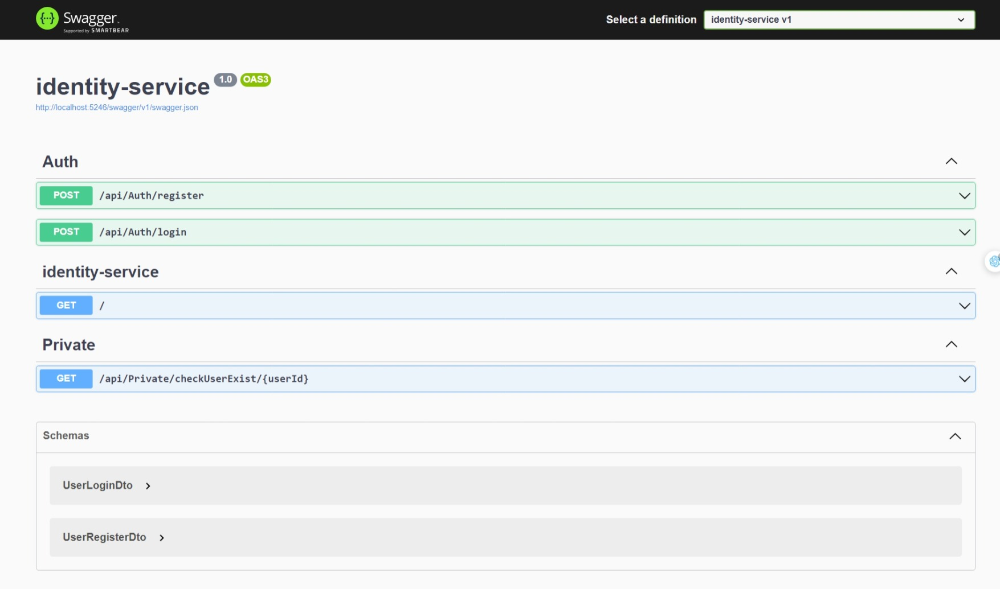
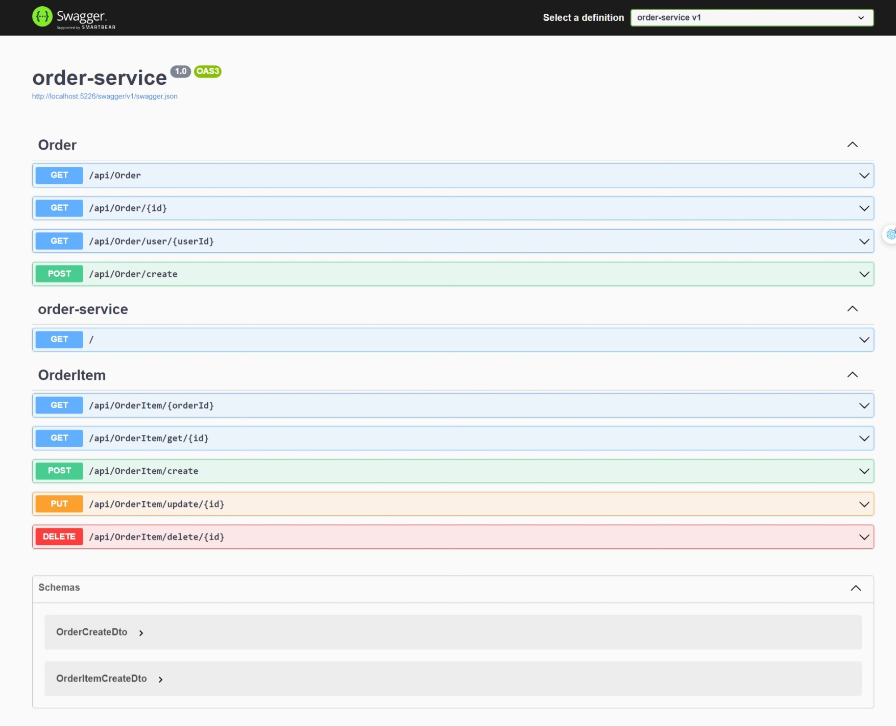
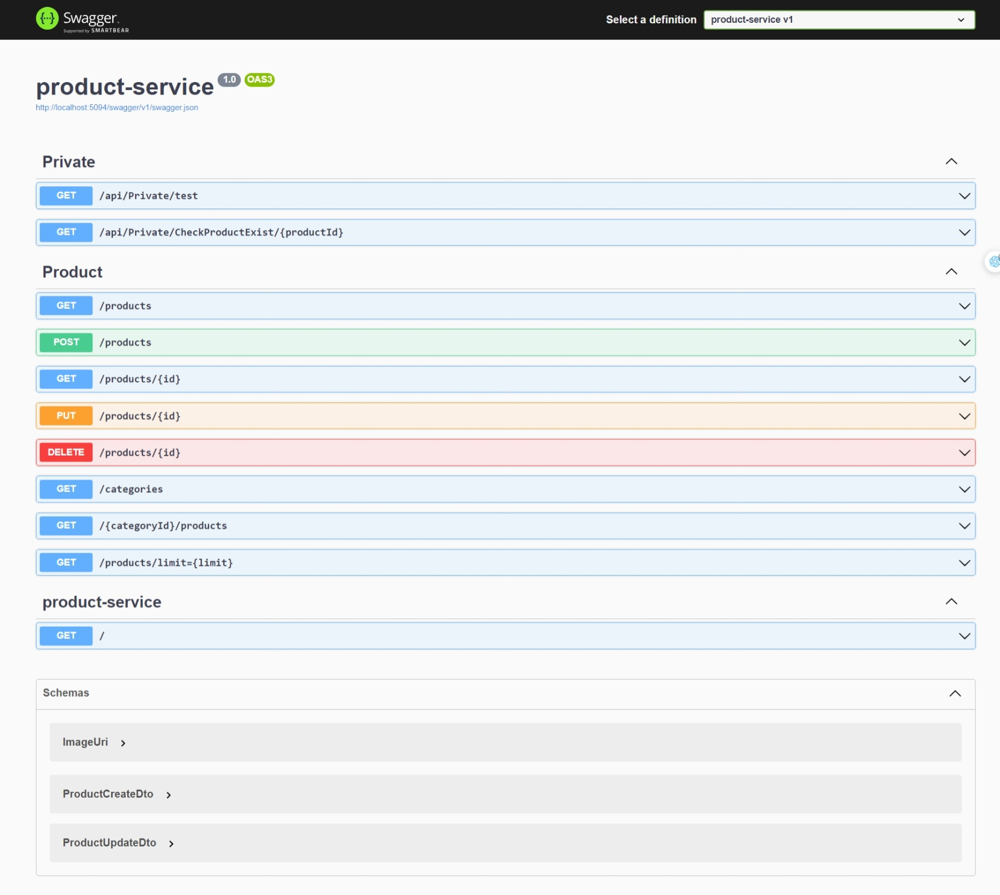

<h1 class="heading">
 HoaClothing - an ecommerce shop website
</h1>

    

    This is my simple project which design in microservices architecture and using docker to deploy.
    

<h2>Project Description</h2>
<ul>
  <li>
      <b>WebClient</b>: This is the front-end of the project, using NextJS to build.
  </li>
  <li>
      <b>Api-gateway</b>: I'm using Nginx to build this service, in order to configure preserve proxy to redirect request to the right service.
  </li>
  <li>
      <b>Product-service</b>: This service is responsible for handling all the request related to product.
  <li>
      <b>Order-service</b>: This service is responsible for handling all the request related to order.
  </li>
  <li>
      <b>Auth-service</b>: This service is responsible for handling all the request related to authentication like login and register, also it's using JWT to authenticate user.
  </li>
  <li>
      <b>MySQL</b>: This is the database of the project.
  </li>
  <li>
      <b>SQL Server</b>: This is the database of the project.
  </li>
  <li>
      <b>Adminer</b>: This is the database management tool.
  </li>
  <!-- i will update this later -->
</ul>

<h2>How to run this project</h2>
<ul>
  <li>
      <b>Step 1</b>: Clone this project to your local machine.
  </li>
  <li>
      <b>Step 2</b>: Run <code>docker-compose up</code> to start the project.
  </li>
  <li>
      <b>Step 3</b>: Open your browser and follow <a href="#api-gateway">this table api gateway</a> to access the service.
  </li>
</ul>

<h2>
  <a name="api-gateway">API Gateway</a>
</h2>

<table class="api-table">
  <tr>
    <th>Name</th>
    <th>URL</th>
    <th>Description</th>
  </tr>
  <tr>
    <td>WebClient</td>
    <td>http://localhost:3000</td>
    <td>NextJS Web client</td>
  </tr>
  <tr>
    <td>Product-service</td>
    <td>http://localhost/product/...</td>
  </tr>
  <tr>
    <td>Order-service</td>
    <td>http://localhost/order/...</td>
  </tr>
  <tr>
    <td>Auth-service</td>
    <td>http://localhost/identity/...</td>
  </tr>
</table>

<h2>
  Api client UI (swaggerUI)
</h2>
<h3>-> Auth Service</h3>

<h3>-> Order Service</h3>

<h3>-> Product Service</h3>

